<h1 align="center">RockPaperScissors.com</h1>

## Rock Paper & Scissors
**RockPaperScissors.com** will help teach you the basics of the classic game called *Rock Paper & Scissors*. The random choices of the computer are meant to emulate another person playing against you to better prepare you for a real battle of *Rock Paper & Scissors!*

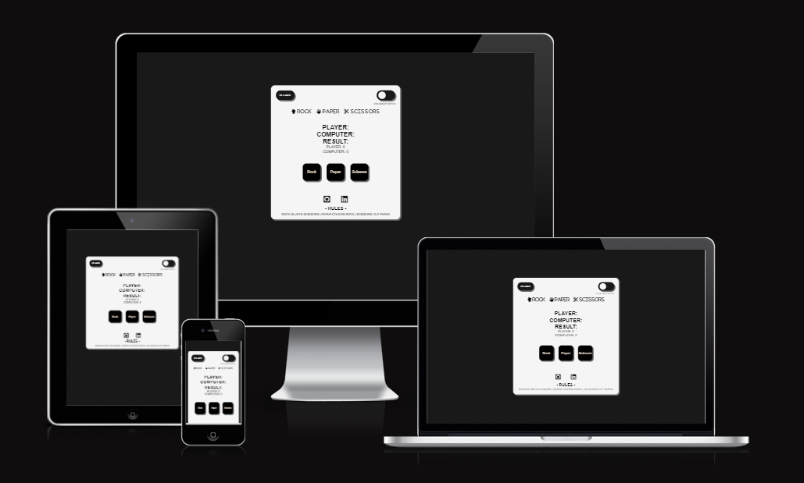

## Live Site
[RockPaperScissors.com](https://madebybrown.github.io/RockPaperScissors.com/)

## Socials
- [Repository](https://github.com/Madebybrown/TheFitnessHub.com.git)
- [Linkedin](https://www.linkedin.com/in/alexander-jonsson-312a70248/)

## Table Of Contents
- [Wireframe](#wireframe)
- [Game Area](#game-area)
    - [Day Mode](#day-mode)
    - [Night Mode](#night-mode)
- [Features](#features)
    - [Header](#header)
        - [Restart](#restart-button)
        - [Day And Night Switch](#day-and-night-switch)
        - [Heading](#heading)
    - [Score Area](#score-area)
        - [Result When Winning](#win-result)
        - [Result When Loosing](#lose-result)
        - [Result When It's a draw](#draw-result)
        - [Options](#options)
        - [Footer](#footer)
        - [Social Links](#social-links)
        - [Game Rules](#game-rules)
    - [Future Features](#features-left-to-implement)
    - [Testing](#testing)
        - [Code Validation](#code-validation)
            - [HTML](#html)
            - [CSS](#css)
            - [Java Script](#java-script)
        - [Lighthouse](#ligthhouse)
            - [First Scan](#first-scan)
            - [Second Scan](#second-scan)
            - [Third Scan](#third-scan)
        - [Responsiveness](#responsiveness)
        - [Web Browser](#web-browsers)
        - [Bugs & Fixes](#bugs--fixes)
    - [Deployment](#deployment)
        - [Step One](#step-one)
        - [Step Two](#step-two)
        - [Step Three](#step-three)
        - [Step Four](#step-four)
        - [Step Five](#step-five)
        - [Step six](#step-six)
    - [Technologies Used](#technonolgies-used)
    - [Credits](#credits)

## Wireframe
Before building anything it's crucial to plan to steer clear of any possible obstacles in the future. Here we have an image displaying the idea I had for the website's appearance on different devices *(Computer, Tablet & Phone)*, some minor style, and feature changes were made during the process but in its entirety, it looks the same.

## Game Area
The finished design of the game is minimal to appear as clean as possible while still being engaging and informative, we will go more in-depth on the features in the [feature section](#features)!

**Day Mode!**

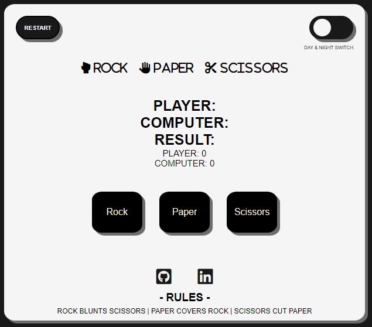

**Night Mode!**

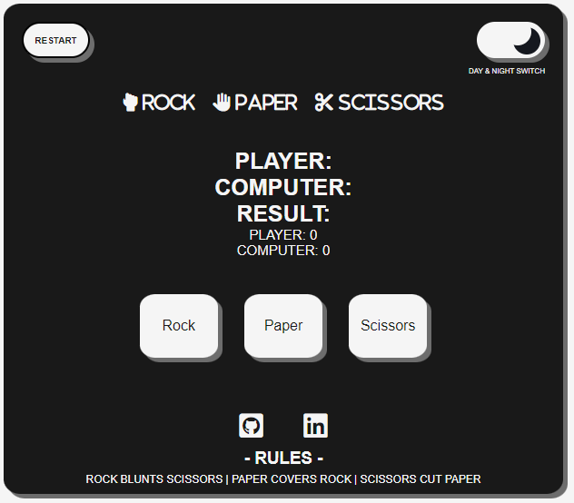

## Features
### **Header**
At the top of the game area on the page, we have the [Restart button](#restart-button) to the left, The [Day & Night Switch](#day-and-night-switch) to the right and the heading in the middle, which is used to convey the name of the game, *Rock Paper & Scissors*.

#### **Restart Button**
- The restart button is used to restart the game and empty all fields when the player chooses to do so.

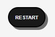 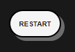

#### **Day And Night Switch**
- The function of the day and night switch is used to invert all the colors on the website depending on if the game is played during the day or at the night.

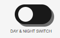 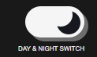
#### **Heading**
##### **Day Mode**
- Heading of the game displayed in the day mode.

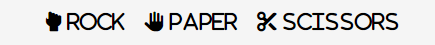

##### **Night Mode**
- Heading of the game displayed in the night mode.

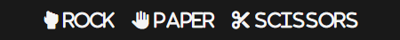

## **Score Area**
- The default score area displays what options the player and the computer chose this round, it also displays the result of those two choices. Points will be updated after every click.

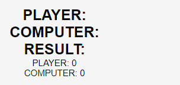 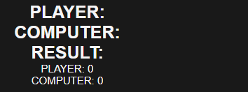

### **Win Result**
- If you win the round, the result will look like this.

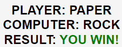 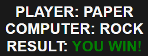

### **Lose Result**
- If you lose the round, the result will look like this.

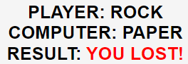 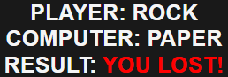

### **Draw Result**
- If you and the computer chose the same option, the result will look like this.

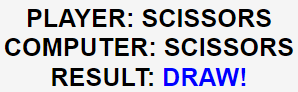 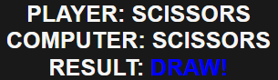

### **Options**
- The option buttons display the choices that are available to the player.

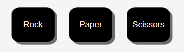 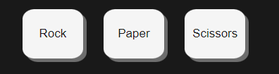

### **Footer**
- In the footer, we have both the links to the developers' socials and the rules for the game.

#### **Social Links**
r
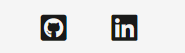 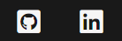

#### **Game Rules**
- An easy explanation of the rules of the game.

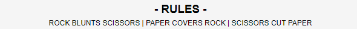 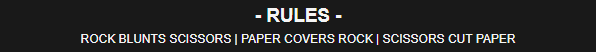

## **Features Left To Implement**
- The ability to set the score limit
- Username creation
- Highscores

## **Testing**

### **Code Validation**

#### **HTML**

The HTML passed validation without any issues.

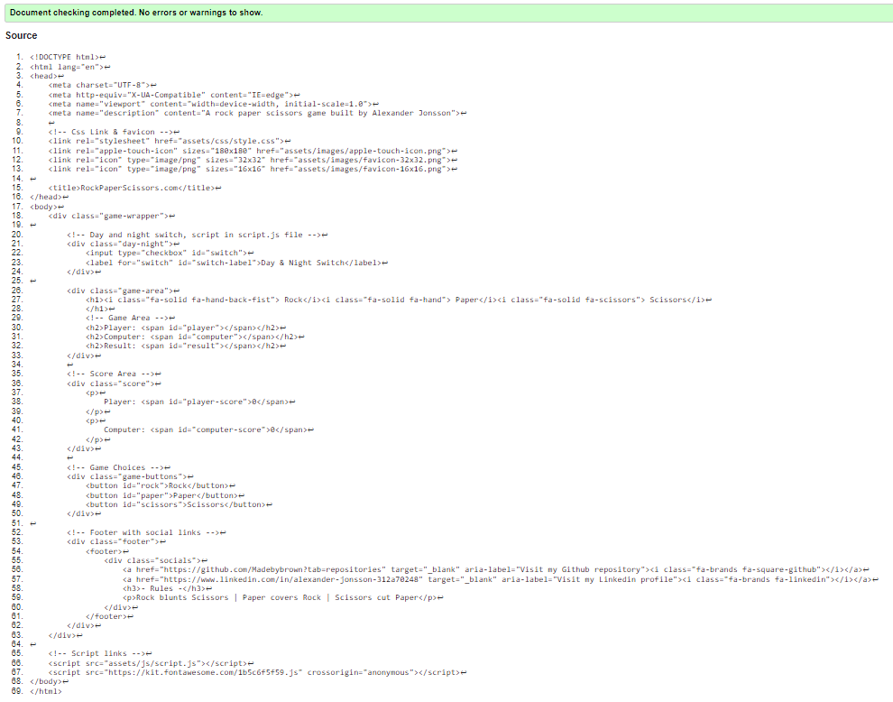

#### **CSS**

CSS passed validation without any issues.

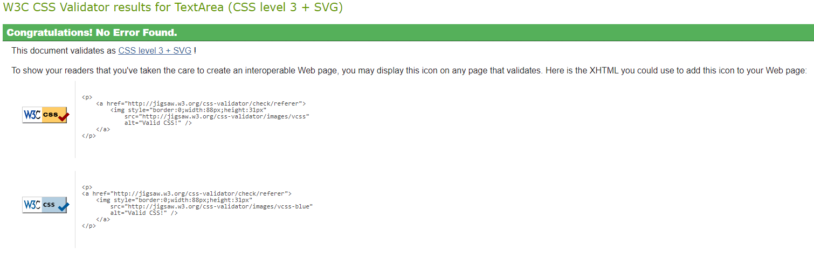

#### **Java Script**

Script passed validation without any issues.

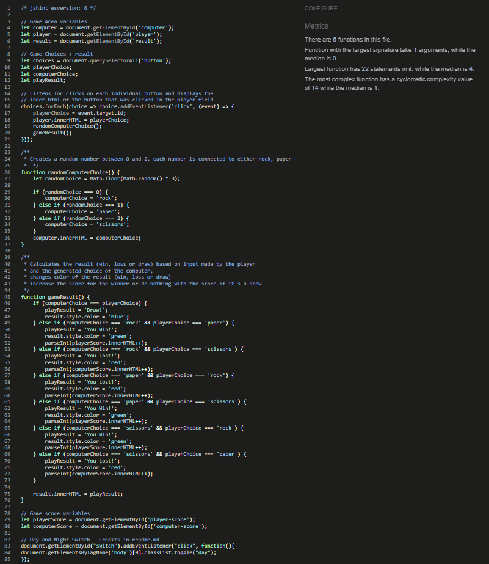

### **Ligthhouse**
#### **First Scan**
The first lighthouse scan came out too low in Accessibility and SEO, the best practices score could also be higher.

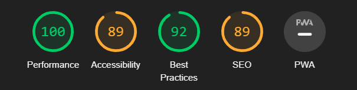

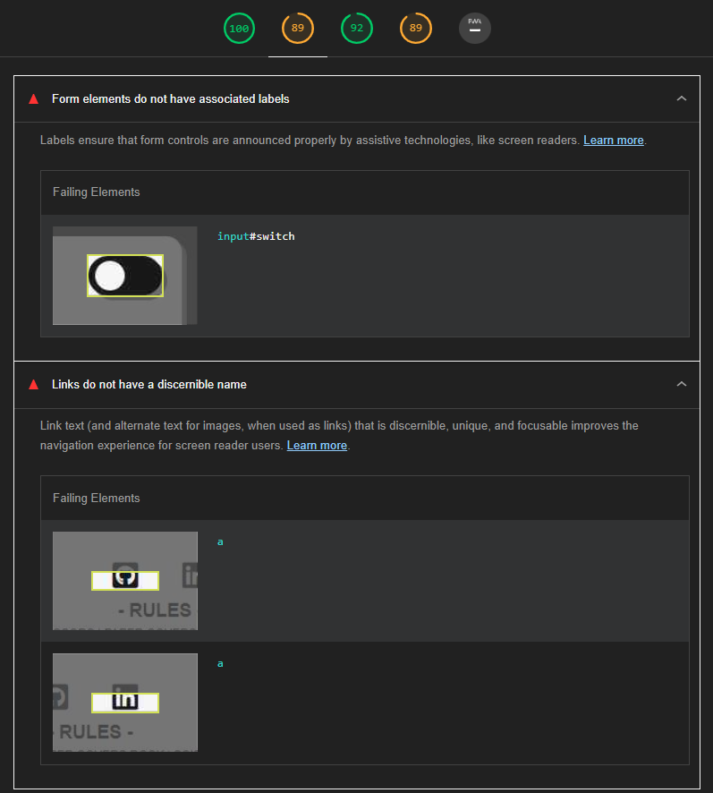

#### **Second Scan**
By adding a label to the input element for the day and night switch and adding Aria-labels to the social links I managed to increase the Accessibility and SEO scores to 100 each.

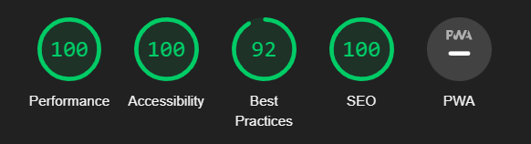

#### **Third Scan**
After cleaning up my code and restructuring some javascript functions to be shorter I managed to increase the score of best practices to 100.

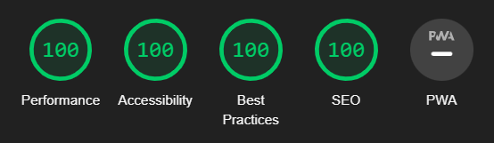

### **Responsiveness**
- I tested the responsive design with [Chrome Dev Tools](https://developer.chrome.com/docs/devtools/)
    - Ipad air & mini
    - iPhone SE, XR, and 12Pro
    - Pixel 5
    - Samsung Galaxy S8, S20 Ultra, A51/71
    - Surface Pro 7 & duo
    - Galaxy Fold
    - Nest Hub & Hub Max

I also tested the website on iPhone 7, 8, and 13 pro, without any known issues.

### **Web Browsers**
I've tried using the website on google Chrome, Microsoft Edge, and Firefox without any issues.

### **Bugs & Fixes**
In the process of developing the game buttons, I encountered a problem with the (i) elements used to add FontAwesome icons to the buttons didn't respond when clicked on and the players result ended up blank and the result was undefined, I solved this by removing the icons from the buttons.

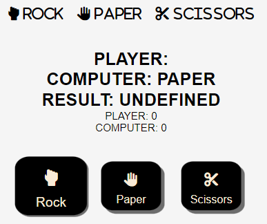

## Deployment

### **Step One**
- The website was deployed using GitHub
1. Enter repositories

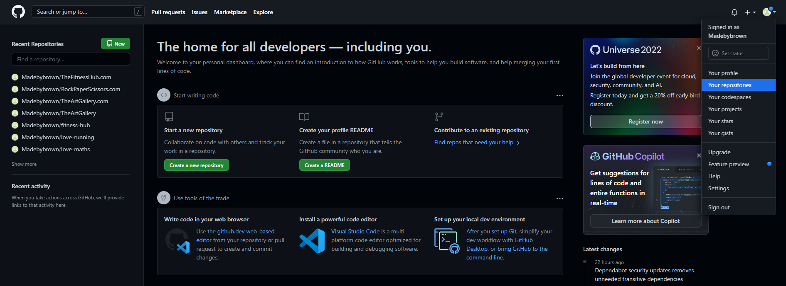

### **Step Two**
2. Locate RockPaperScissors.com and click it

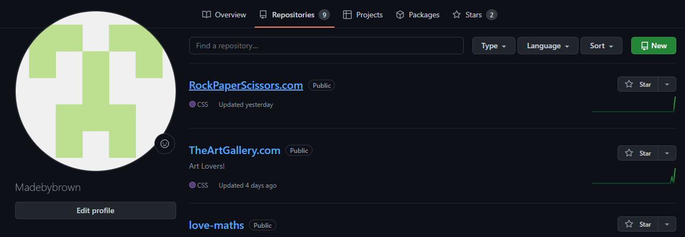

### **Step Three**
3. Go to settings

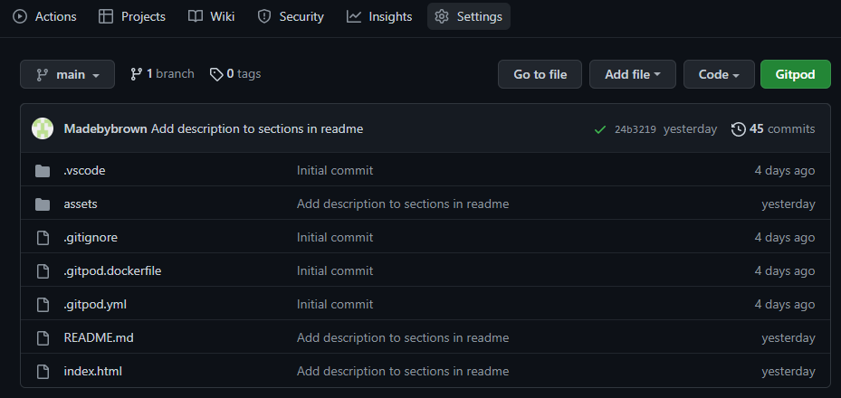

### **Step Four**
4. On the left-hand side is a section called Pages, click it

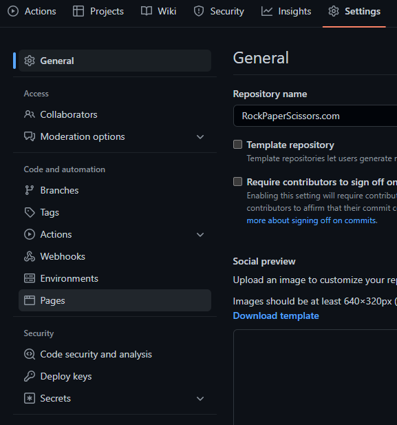

### **Step Five**
5. Select the Branch to be "Main" and click save

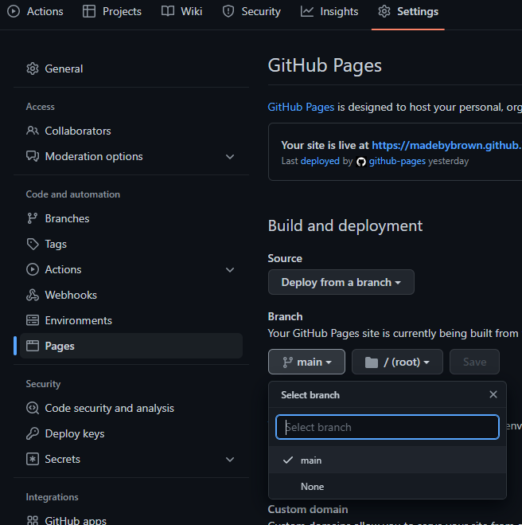

### **Step Six**
6. Now wait a few minutes for GitHub to build and deploy your site then refresh the page and at the top of the Pages section you will find the link to your deployed website.

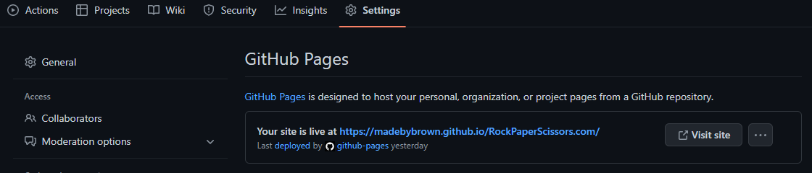

## Technologies Used
- [HTML](https://sv.wikipedia.org/wiki/HTML)
- [CSS](https://en.wikipedia.org/wiki/CSS)
- [JavaScript](https://www.javascript.com/)
- [ColorMind](http://colormind.io/)
- [Miro](https://miro.com/)

## Credits
- [Rock, Paper & Scissors](https://sebhastian.com/rock-paper-scissors-javascript/)
- [Rock, Paper & Scissors - 2](https://www.geeksforgeeks.org/rock-paper-and-scissor-game-using-javascript/)
- [Day and Night Switch](https://www.foolishdeveloper.com/2021/11/day-and-night-mode-javascript.html)
- [Favicon instructions](https://favicon.io/favicon-converter/)
- [Favicon images](https://www.flaticon.com/free-icons/rock-paper-scissors)

[**BACK TO THE TOP**](#rock-paper--scissors)