<h1 align="center">RockPaperScissors.com</h1>

## Rock Paper & Scissors
**RockPaperScissors.com** will help teach you the basics of the classic game called *Rock Paper & Scissors*. The random choices of the computer is meant to emulate another person playing against you to better prepare you for a real battle of *Rock Paper & Scissors!*

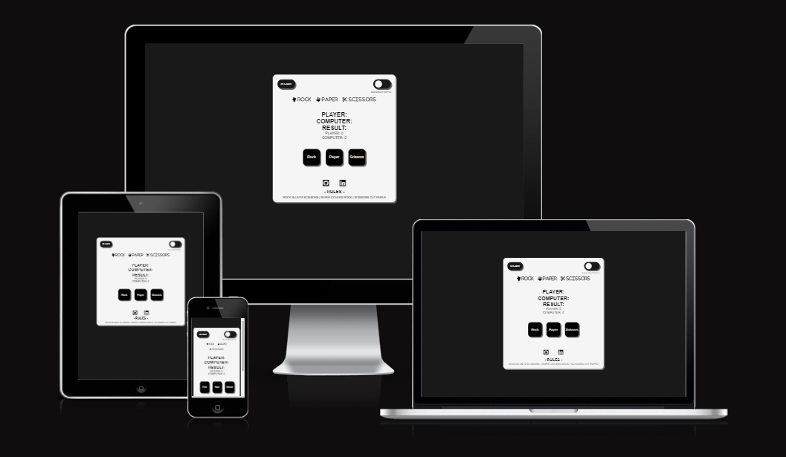

## Wireframe
Before building anything it's crucial to plan ahead to steer clear of any possible obstacles in the future. Here we have an image displaying the idea I had for the websites apperance on different devices *(Computer, Tablet & Phone)*, some minor style and feature changes where made during the process but in it's entierity it looks the same.

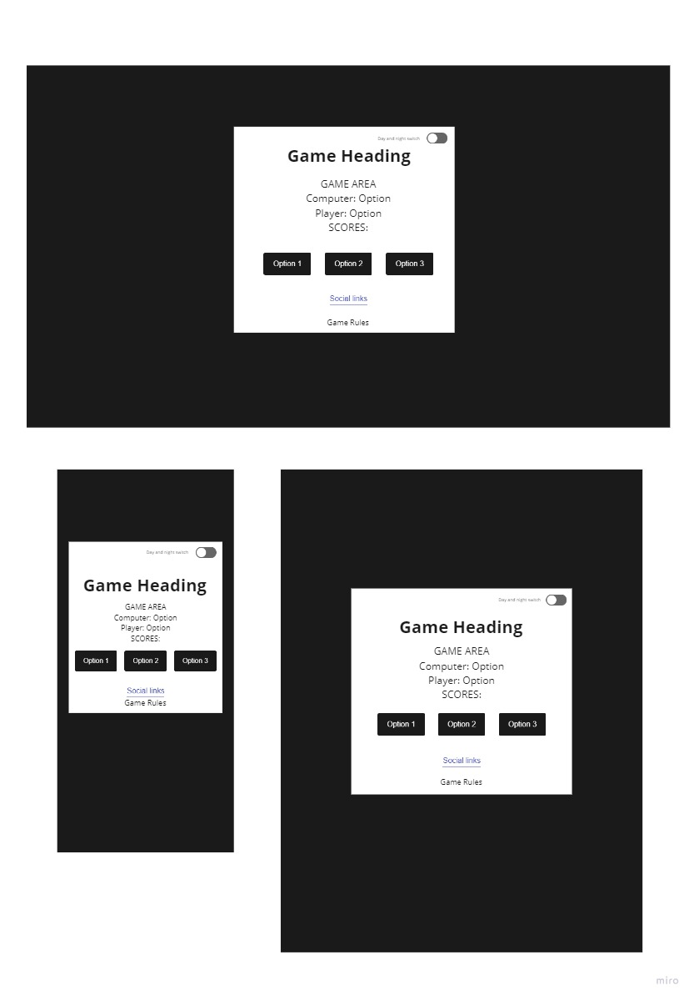

## Game Area
The finished design of the game looks like this, we will go more in depth in the [features section](#features)!

**Day Mode!**

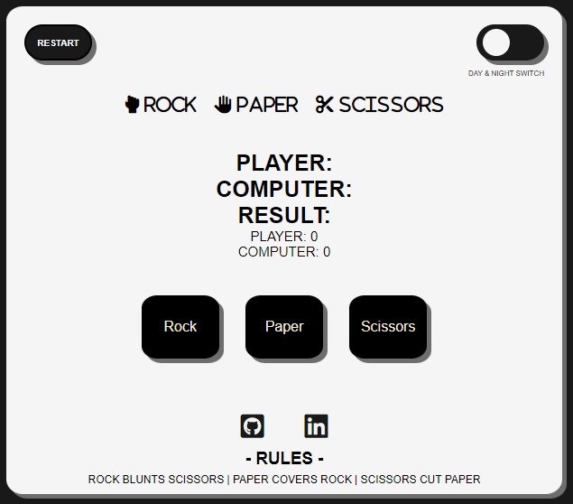

**Night Mode!**

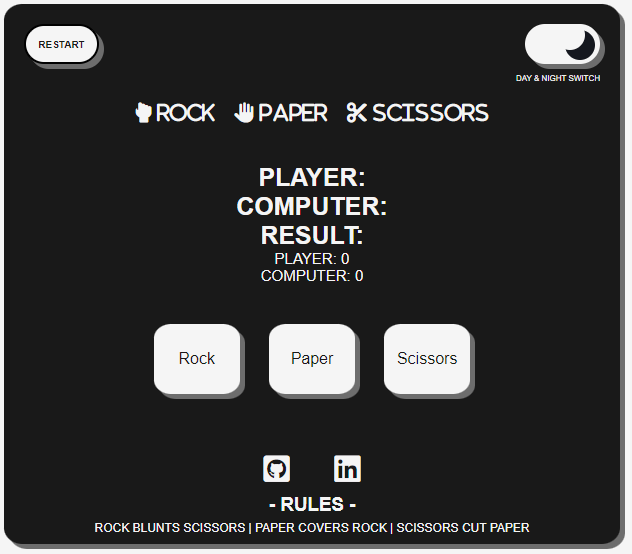

## Features
### **Header**
At the top of the game area on the page we have the [Restart button](#restart-button) to the left, The [Day & Night Switch](#day-and-night-switch) to the right and the heading in the middle, wich is used to clearly convey the name of the game, *Rock Paper & Scissors*.

### **Restart Button**
- The restart button is used to restart the game and empty all fields when the player chooses to do so.

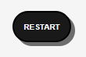 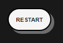

### **Day And Night Switch**
- The function of the day and night switch is used to invert all the colors on the website depending on if the game is played at the day or at the night.

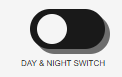 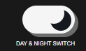

#### **Day Mode**
- Heading of the game displayed in the day mode.

#### **Night Mode**
- Heading of the game displayed in the night mode.

### **Score Area**
- The default score area displays what options the player and the computer chose this round, it also displays the result of those two choises. Points will be updated after every click.

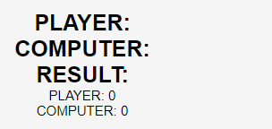 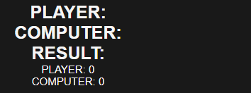

#### **Win Result**
- If you win the round, the result looks like this.

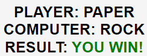 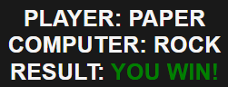

#### **Lose Result**
- If you lose the round, the result looks like this.

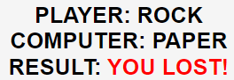 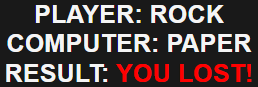

#### **Draw Result**
- If you and the computer chose the same option, the result looks like this.

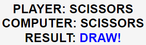 

### **Options**
- The option buttons are used to clearly convey the options the player has at every round of the game.

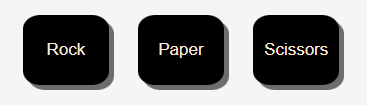 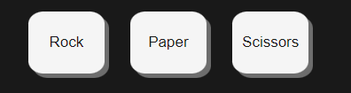

### **Footer**
- In the footer we have both the links to my socials and the game rules.

#### **Social Links**
- To easier get in contact with the developer and take a look at the *GitHub* repository.

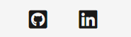 

#### **Game Rules**
- An easy explenation of the rules of the game.

 

## Credits
- [Rock, Paper & Scissors](https://sebhastian.com/rock-paper-scissors-javascript/)
- [Rock, Paper & Scissors - 2](https://www.geeksforgeeks.org/rock-paper-and-scissor-game-using-javascript/)
- [Day and Night Switch](https://www.foolishdeveloper.com/2021/11/day-and-night-mode-javascript.html)
- [Favicon instructions](https://favicon.io/favicon-converter/)
- [Favicon images](https://www.flaticon.com/free-icons/rock-paper-scissors)